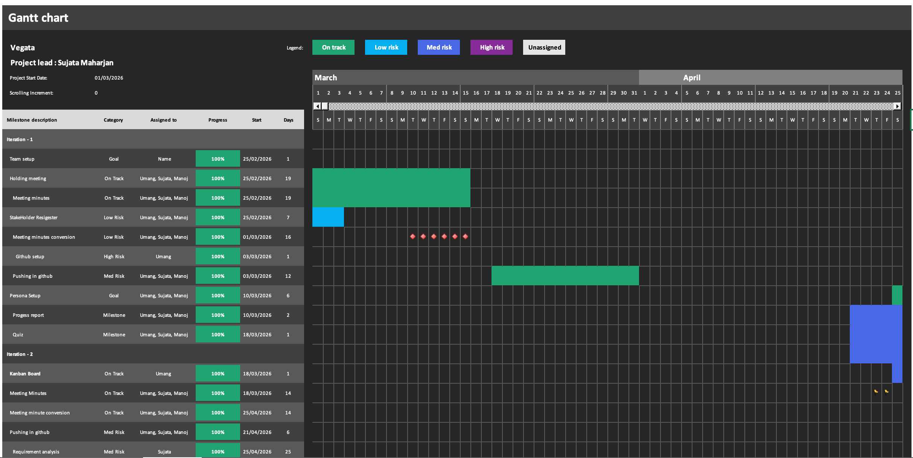
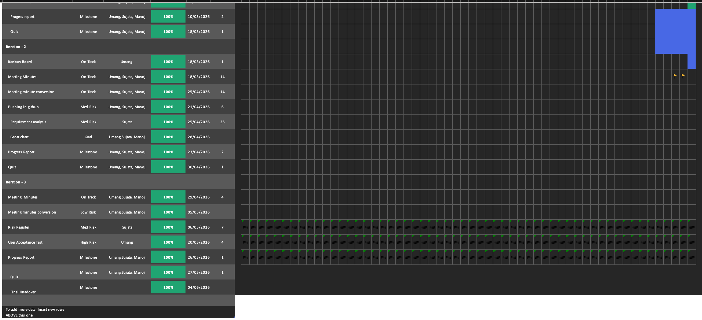

# Vegata Project Gantt Chart

## Project Information

| Field | Value |
|---------|---------|
| Project Name | Vegata |
| Project Lead | Sujata Maharjan |
| Project Start Date | 01 March 2026 |

---

## Iteration 1

| Task | Category | Assigned To | Progress | Start Date | Duration (Days) |
|--------|--------|--------|--------|--------|--------|
| Team setup | Goal | Name | 100% | 25 Feb 2026 | 1 |
| Holding meeting | On Track | Umang, Sujata, Manoj | 100% | 25 Feb 2026 | 19 |
| Meeting minutes | On Track | Umang, Sujata, Manoj | 100% | 25 Feb 2026 | 19 |
| Stakeholder Register | Low Risk | Umang, Sujata, Manoj | 100% | 25 Feb 2026 | 7 |
| Meeting minutes conversion | Low Risk | Umang, Sujata, Manoj | 100% | 01 Mar 2026 | 16 |
| GitHub setup | High Risk | Umang | 100% | 03 Mar 2026 | 1 |
| Pushing in GitHub | Medium Risk | Umang, Sujata, Manoj | 100% | 03 Mar 2026 | 12 |
| Persona Setup | Goal | Umang, Sujata, Manoj | 100% | 10 Mar 2026 | 6 |
| Progress Report | Milestone | Umang, Sujata, Manoj | 100% | 10 Mar 2026 | 2 |
| Quiz | Milestone | Umang, Sujata, Manoj | 100% | 18 Mar 2026 | 1 |

---

## Iteration 2

| Task | Category | Assigned To | Progress | Start Date | Duration (Days) |
|--------|--------|--------|--------|--------|--------|
| Kanban Board | On Track | Umang | 100% | 18 Mar 2026 | 1 |
| Meeting Minutes | On Track | Umang, Sujata, Manoj | 100% | 18 Mar 2026 | 14 |
| Meeting Minute Conversion | On Track | Umang, Sujata, Manoj | 100% | 25 Apr 2026 | 14 |
| Pushing in GitHub | Medium Risk | Umang, Sujata, Manoj | 100% | 21 Apr 2026 | 6 |
| Requirement Analysis | Medium Risk | Sujata | 100% | 25 Apr 2026 | 25 |
| Gantt Chart | Goal | Umang, Sujata, Manoj | 100% | 28 Apr 2026 | Not Specified |
| Progress Report | Milestone | Umang, Sujata, Manoj | 100% | 23 Apr 2026 | 2 |
| Quiz | Milestone | Umang, Sujata, Manoj | 100% | 30 Apr 2026 | 1 |

---

## Iteration 3

| Task | Category | Assigned To | Progress | Start Date | Duration (Days) |
|--------|--------|--------|--------|--------|--------|
| Meeting Minutes | On Track | Not Assigned | 100% | 29 Apr 2026 | 4 |
| Meeting Minutes Conversion | Low Risk | Not Assigned | 100% | 05 May 2026 | Not Specified |
| Risk Register | Medium Risk | Not Assigned | 100% | 06 May 2026 | 7 |
| User Acceptance Test | High Risk | Not Assigned | 100% | 20 May 2026 | 4 |
| Progress Report | Milestone | Not Assigned | 100% | 26 May 2026 | 1 |
| Quiz | Milestone | Not Assigned | 100% | 27 May 2026 | 1 |
| Final Handover | Milestone | Not Assigned | 100% | 04 Jun 2026 | Not Specified |

---

## Notes
### Risk Categories Used

- Goal
- Milestone
- On Track
- Low Risk
- Medium Risk
- High Risk

